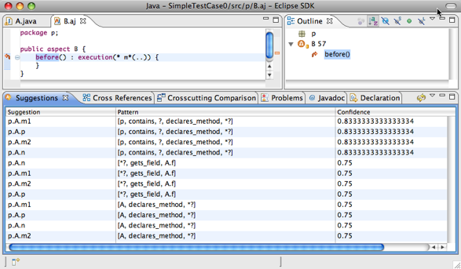

# Rejuvenate Pointcut

 A tool for pointcut expression recovery in evolving Aspect-Oriented software.

## Introduction

Rejuvenate Pointcut is an open source, research prototype [Eclipse](http://www.eclipse.org) plugin that limits the problems associated with fragile pointcuts in AspectJ by assisting developers in rejuvenating pointcuts as the base-code evolves.

Development of the tool is current in its early stages and we welcome interested participants to join in the development effort by contacting the initial [author](mailto:khatchad@cse.ohio-state.edu). It is built as an extension to the [AspectJ Development Tools (AJDT)](http://www.eclipse.org/ajdt/) and leverages the [JayFX fact extractor plugin](http://www.cs.mcgill.ca/~swevo/jayfx/), the [Drools rules engine](http://www.jboss.org/drools/), and the [JDOM](http://www.jdom.org/) XML parser. Please visit the [research web site](http://tinyurl.com/63qv97) for more details about the internals of the tool.

## News

The plugin now works with the latest AJDT version (version 2.0.2 as of this writing). The plugin was rewritten to incorporate significant architectural changes in this new version of AJDT.

## Download

The latest stable release is [Rejuvenate Pointcut 1.2](https://github.com/khatchad/Rejuvenate-Pointcut/raw/master/files/RejuvenatePointcut-1_2.zip) and has been tested with [Eclipse 3.5 SR2](https://www.eclipse.org/downloads) and [AJDT 2.0.2](http://www.eclipse.org/ajdt/downloads/). The archive also includes source code used for that particular version. To install, simply unzip the archive into your Eclipse distribution directory. We hope to have an automated update site set up in the near future. Also feel free to check out the latest sources from the SVN repository.

## Getting started

Take a look at the GettingStarted page. Also, slides from a recent tool demonstration at the International Conference on Aspect-Oriented Software Development (AOSD '09) are available [here](http://www.cse.ohio-state.edu/~khatchad/talks/aosd09.pdf). A research poster depicting an earlier version of the tool, presented at AOSD '08, is available [here](http://www.cse.ohio-state.edu/~khatchad/posters/aosd08-poster.pdf).

## Getting help

Please feel free to post to the [General User Discussion](http://groups.google.com/group/rejuvenate-pc-users) list with any comments, questions, or concerns.
